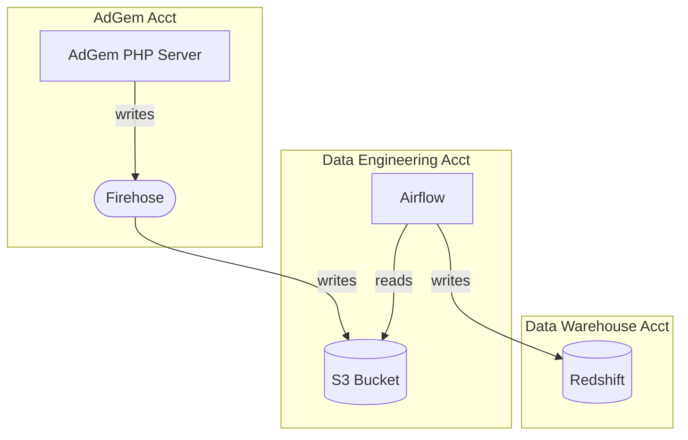
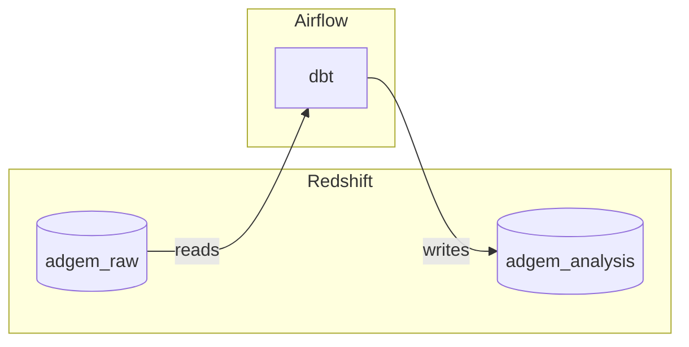
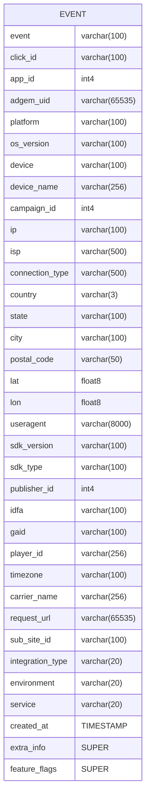

# 0002: Analytical Events Architecture

## STATUS

    Accepted

## CONTEXT

Event tracking in the AdGem system is implemented in several
inconvenient ways.  There are at least 3 methods of making calls to
save events, and there are several different tables and firehoses to
store the data, with a wide, sparsely populated structure.
Additionally, AdAction has built a new data warehouse, and these
events remain in a legacy AdGem specific warehouse.

We need an easy to use method to store events in the new warehouse.

### Considered Options

 * Write to a firehose that dumps to a data engineering S3 bucket
   to be loaded into the raw data warehouse and then transformed
   for analysis via Airflow and dbt. - DECISION
 * Write to a firehose that dumps to a data engineering S3 bucket
   to be loaded into the data warehouse via a lambda.

## DECISION

The data will be published to a firehose in the AdGem account.  This
firehose is configured to dump to an S3 bucket in the
`data-engineering-prod` account.  From there, it is loaded via
**Airflow** into the `events_raw` table in the `adgem_raw` database on
the modern data-warehouse.  Airflow then uses DBT to transform the
data into a format ready for analysis in the `events` table in
`adgem_analysis`.

### Data Flow

Data is initially ingested in a "raw" format with all fields being
basic varchars. DBT is then used to transform the data into typed
columns for analysis.  The advantage here is it minimalized the risk
of data being lost due to bad formats or types.

Attributes common to (nearly) all event types will be stored in
columns on the event record table.  Data unique to specific event
types will be stored in a *SUPER* json column within Redshift. This
will allow for easy querying of the data without having to create new
columns for each new event type.

### Data schema

### Other options
Although there is a reference implementation of using a lambda for the
data loading available with `service_hub`, all new data efforts are
using the Airflow/dbt stack. As such we've decided to build with
Airflow.

## CONSEQUENCES

All raw production data will be captured and preserved in the
`events_raw` table. There will only be debug logging of the events
in development, staging, and CI environments.

It will be simpler to have a single schema from a maintenance
perspective. We will not need to generate new firehoses and tables for
each new type of event created. Querying the data could be simpler or
more complicated depending on the use case.

### Risks

With no local database for development of these events there won't be
a true test of the flow until staging or unless the developer connects
to the production stream.

## NOTES

### References

### Original Author
 - Ron White

### Approval date

### Approved by

## Appendix
